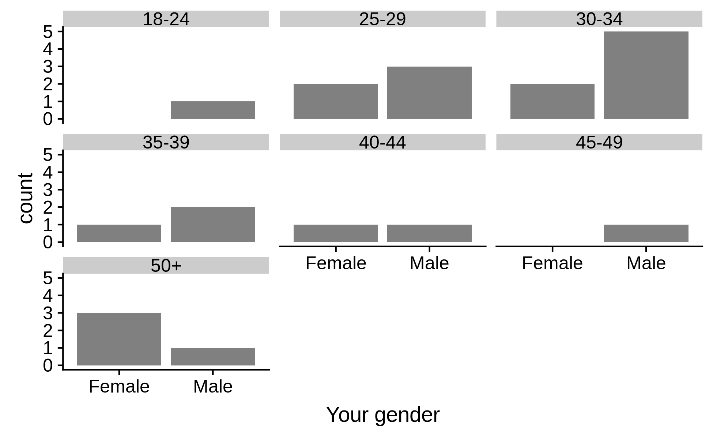
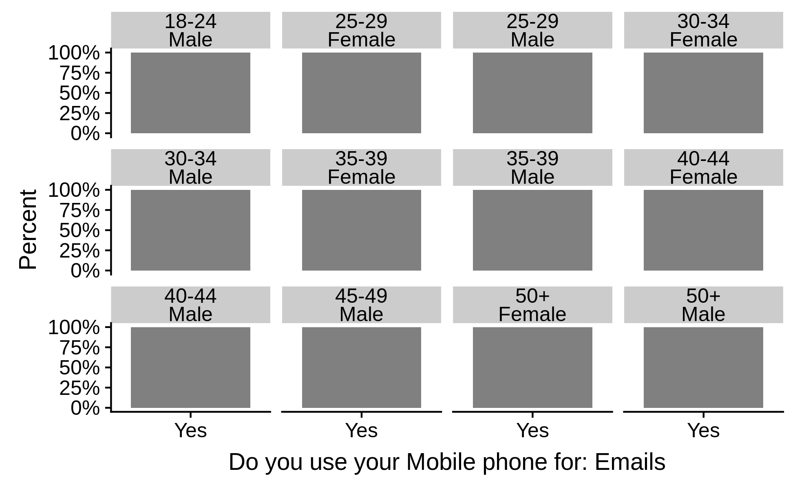
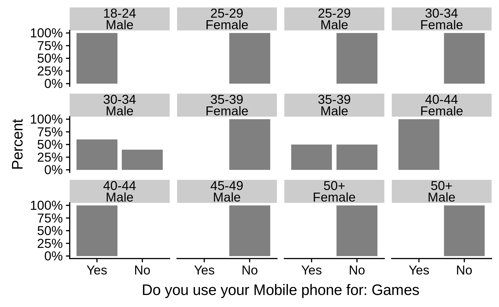
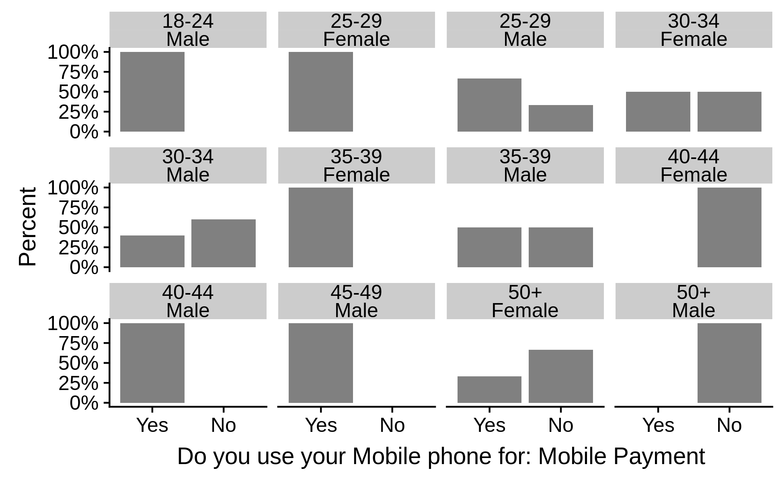
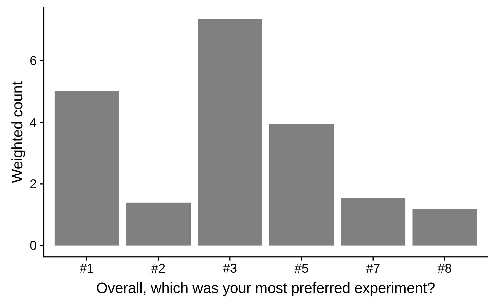
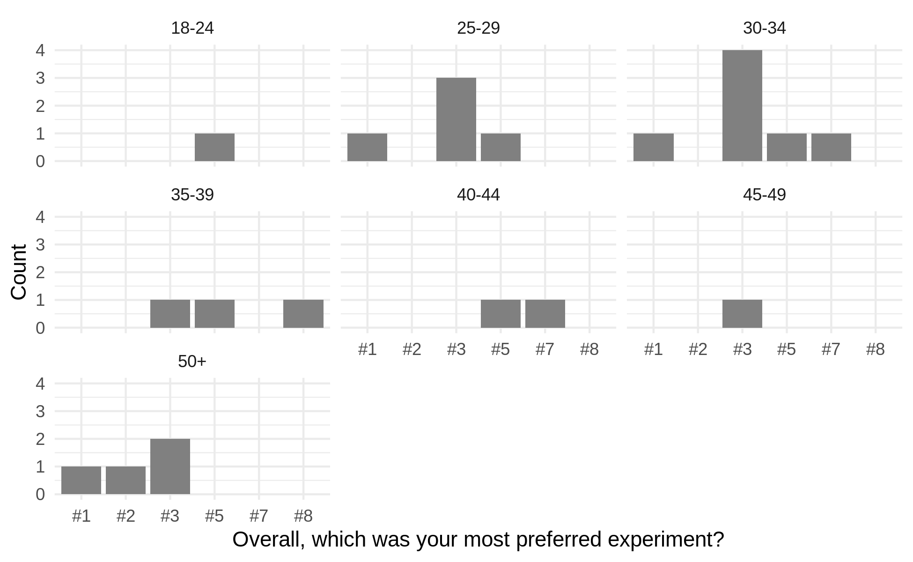
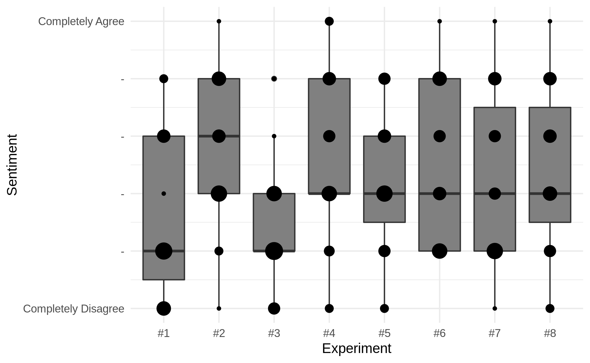
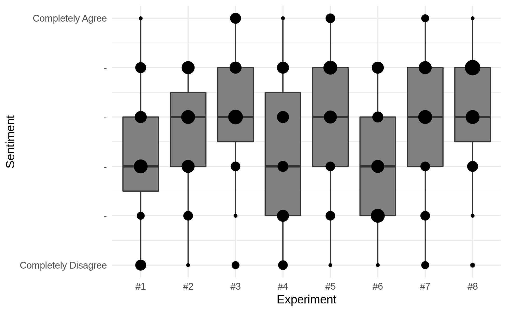
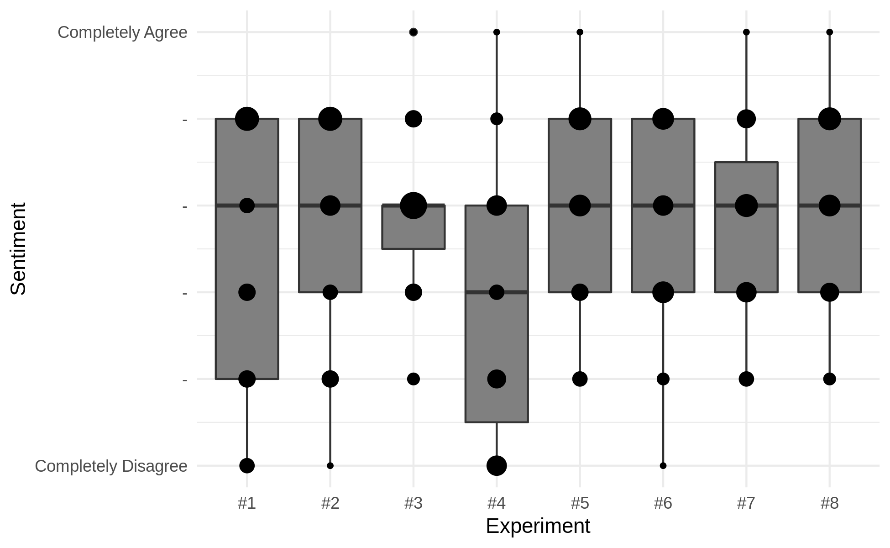

<section>

# UX and Design Deliverables

## Persona and Wireframes

!! annotate persona & wireframes here

## Branding Assets

!! present visual designs here
(Label, Bottle, Vending Machine, Banner)

</section>
<section>
          
# User Research Results

This chapter provides a selection of data presentations, be that in tabular form, graphical representation or both. 
The assessment of the quantitative data spans over 50 sides of A4 and the aggregation of qualitative data is a similar length, so it's impractical to present all the data in this chapter.
The entire set of data evaluation can be found as part of the appendices.
This chapter will concentrate on the ways that the data was examined that are most significant to dissertation, with regard to best possible outcomes.

## Basic Participant Data 

What follows is some minimal demographic information about the 23 participants that made up the group of experiment testers, as well as some information concerning their experience with technology relevant to the study.

There participants were mostly male be a ratio of about 3:2, the younger age groups were better represented, however the gender disparity was greater among those younger age groups with a stronger male representation for those under 35 (about 5:2). This was down to the participants that were able to take part.

Gender|Count
:-----:|:-----:
Female|9
Male|14
Table: Gender Demographics {#tbl:tb-demo-gender}

Age group|Count
:-----:|:-----:
18-24|1
25-29|5
30-34|7
35-39|3
40-44|2
45-49|1
50+|4
Table: Age Demographics {#tbl:tb-demo-age}

{#fig:fig-demo-age}

{#fig:fig-demo-age-gender}

### Familiarity with technology

Data was also captured from each participant to assess their familiarity with technology, specifically smartphone usage for various interactions and AR. 
These results are helpful to provide context for the results of the experiments.

{#fig:fig-use-mob-email}

{#fig:fig-use-mob-game}

{#fig:fig-use-mob-pay}

{#fig:fig-use-mob-sm}

{#fig:fig-fam-ar}

All participants accessed their emails on their mobile phones and every single demographic that was captured by the study, apart from those over fifty used social media on their mobile phones.
Participants at the older end of the spectrum appear not to play games on their mobile phones, nor do those in the young age groups of this sample of users whereas the middle age groups 30-34, 35-39, and 40-44 seem to be more inclined to play games on their mobile phones.
Broadly speaking using a smartphone to make mobile payments is more popular among females but more significantly those of both genders in the younger age groups show a higher frequency of mobile payment, with the frequency declining with age. 
The data also suggest familiarity with Augmented Reality to be more frequent among males with no prior experience for females of any age group. 
Any correlation between age and familiarity cannot be said to be linear, though the 50+ age group was the only male demographic to have no prior experience.

### Weakness in the sample set

The 18-24 and 45-49 age groups were populated by just one participant each, consequently feedback for these demographics were the least reliable; 
the next least reliable age groups are the 40-44 and 35-39 age groups, in that order. 
Note having at least one person of each gender to cover the age ranges can be considered a major point of concern, and ideally age demographic subset would each have at least five to ten people to allow for more variation of opinion within a given demographic.
One way the disparity in sample size per age group was for mitigated, to some merged age groups allowing for a broader trend analysis but with greater sample sizes per age group and this can be seen in the following analysis.
Another technique used to allow age groups that were under represented to count for the amount they should with regard to normal population distribution for the UK was to apply proportionate weighting to the answers based on the demographics of the country.
This kind of weight adjustment is common practice in order to allow the results to better reflect the population.

## Initial Findings

What follows is some basic evaluation of the experiments based on some simple question regarding the component parts of the experiments and the participants favourite experiment experience.
These results provide more context from which later examination of the data can be compared.

### Component Perception

Two components that are included in all the experiments, in fact being the bedrock of all interactions are the use of a smartphone for the bulk of the interaction and the IoT BLE beacon prompting the phone.
The following box plot graphs indicate how these fundamental element were received by the testers.

{#fig:fig-perc-mob}

{#fig:fig-perc-iot}

Broadly speaking most participant across every demographic, with the exception of a few outliers, were comfortable with the idea of using a smartphone as part of these interactions.
The IoT element has more polarising results with more overall positivity from the entire subset of females when compared to males, which not only had greater variation but a significant number of scores below the top half of the sentiment scale.

### Preferred Experiment

The question about which experiment was the user's preferred experience gave the participants a choice just to pick one experiment out of the eight variations.
This makes it an appropriate example to demonstrate how the result may differ if they were to take into account the relative population of the demographic subsets.

Preferred Exp|Count
:-----:|:-----:
#1|3
#2|1
#3|11
#4|0
#5|5
#6|0
#7|2
#8|1
Table: Preferred Experiment {#tbl:tb-pref-exp}

Preferred Exp|Weighted Count
:-----:|:-----:
#1|5.023257
#2|1.390666
#3|7.363726
#4|0.000000
#5|3.942898
#6|0.000000
#7|1.555085
#8|1.192840
Table: Preferred Experiment {#tbl:tb-pref-exp-w}

{#fig:fig-pref-exp}

{#fig:fig-pref-exp-w}

 Experiment #3 was the most popular while the experiments #4 and #6 did not get a single vote; 
 Experiment #3 was the simplest interaction that involved an element of reward.
 Looking at these relatively crude results, those experiments - excluding the baseline - that also scored better rewarded the user.
 Experiments #4 and #6 also happen to incorporate the Social Media element without the Digital Reward.
 Figure {@fig:fig-pref-exp-w} demonstrates how weighting users feedback can change the findings, in this case with #1 being more highly regarded.

#### Preferred Experiments by Age Group

This next graph is an example of the granularity with which the data can be studied but also the potential flaws in doing so.
In this case the relatively small sample size manages to demonstrate how it's not necessarily possible to gain truly meaningful data if the results are examined too finely.

{#fig:fig-pref-exp-ages}

While the data suggests results that can point to preferences within all age groups, when two age demographics only contain one participant (18-24, 45-49) as well as the 40-44 age group only having two and the 35-39 group only having three, then if the findings are looked at in this level of detail, it's not wise to attribute too much confidence to the results.
The larger the sample size for a given sub-group, the more confidence can be given to findings even if the analysis is covering a broader group of people.

#### Preferred Experiments Across Age and Gender With Weighted Values

Given the previous example, what follows is an example of how the data was transformed with the intent of making the data more likely to present results that can be more confidently considered as representative of the general public.

Preferred experiment|Your age range|Your gender|Weight|Weight percent
:-----:|:-----:|:-----:|:-----:|:-----:
#3|18-29|Female|0.6102901|0.5000000
#5|18-29|Female|0.6102901|0.5000000
#1|30-34|Female|0.5834226|0.5000000
#3|30-34|Female|0.5834226|0.5000000
#7|35-44|Female|1.3224872|0.5257713
#8|35-44|Female|1.1928405|0.4742287
#2|45+|Female|1.3906661|0.3333333
#3|45+|Female|2.7813323|0.6666667
#1|18-29|Male|0.4038044|0.1659284
#3|18-29|Male|0.8076089|0.3318569
#5|18-29|Male|1.2221926|0.5022147
#3|30-34|Male|0.6977944|0.6000000
#5|30-34|Male|0.2325981|0.2000000
#7|30-34|Male|0.2325981|0.2000000
#3|35-44|Male|0.5879894|0.2384573
#5|35-44|Male|1.8778167|0.7615427
#1|45+|Male|4.0360299|0.7570416
#3|45+|Male|1.2952884|0.2429584
Table: Most Preferred Experiments Adjusted for Population Weighting and Aggregated Age Groups {#tbl:tb-pref-exp-age-gender-weighted-pc}

{#fig:fig-pref-exp-age-gender-weighted-pc}

Now that there are larger age demographic subsets it's more possible to get competing values for the preferred experiment.
With the increased likelihood of competing results comes greater confidence that if a given value is noticeably greater than another, then it represents something meaningful pertaining to public perception.
In this case in particular, it is now more reliable to suggest that experiment #3 is the most popular experience for the 30-34 and 45+ groups while #5 is most popular with the youngest age group and males in the 35-44 bracket.
Nevertheless, this evaluation isn't definitive and shouldn't be taken as fact in any way as it is only one way the data has been examined; in particular, this evaluation relies on fewer data points to come to these suggestions.
Ostensibly, the more data points used when trying to derive meaning, the greater the potential for accuracy, so long as the observations used are relevant to the question looking to be answered.

## Evaluating Feedback Through Experiment Qualities

Another way of inspecting the feedback is to not take an angle that filters based on the human properties of the participants but instead looks at the properties of the experiments.
The experiments were scored by the test users against various properties (described as 'facets' within the study report) the experiments could possess.
The feedback questionnaire required mandatory evaluation of these characteristics using a scalar metric, based on the level of agreement with the statement related to the potential attributes of each experiment.

To re-iterate, the facets of the experiments intended to be measured were:
- Enjoyment
- Annoyance
- Ease of use
- Brand connection
- Engagement
- Persuasiveness
- Interest

This perspective of analysis makes it easier to compare the experiments against one another on a more nuanced level that has less to do with the users (at this stage) and more about how the experiences felt to the users in ways that would be otherwise difficult to quantify.
It is because of this that the approach to interpreting the data can add extra value through a different lens.
A high level description of what the following graphs depicts is provided but for further detail, the full report in the appendix is available.

{#fig:fig-facet-enjoyment}

{#fig:fig-facet-annoyance}

{#fig:fig-facet-ease-of-use}

{#fig:fig-facet-brand-connection}

{#fig:fig-facet-engagement}

{#fig:fig-facet-persuasiveness}

{#fig:fig-facet-interest}

### Facet Evaluation Summaries

#### Enjoyment

Figure {@fig:fig-facet-enjoyment} shows experiments #3 (Loyalty Reward) and #5 (Loyalty Reward, Augmented Reality) have the most positive results with ranges that are mostly positive and very much skewed to the top end. With greater inspection it appears that #5 is considered most enjoyable because the candlestick median line is the highest of all experiments, just one below the maximum value on the scale.

#### Annoyance

The lowest median lines in figure {@fig:fig-facet-annoyance} suggest that, experiments #1 (baseline) and #3 (Loyalty Reward) were considered least annoying, with both having median lines drawn at the second lowest position on the scale; experiment #1 has a longer candlestick, indicating more variation in participant scores for this quality when compared to experiment #3 which is more skewed to the bottom.

#### Ease of use

It is easy to see from figure {@fig:fig-facet-ease-of-use} that all experiences scored well in this category but the top three experiment for ease of use in ascending order are #3 (Loyalty Reward), the baseline #1, and #4 (Social Media); 
all three of these experiment have the majority of participant scores in the top two points on the scale but while #3 and #1 have a distribution that includes scores in the lower half of the y scale, #4 was considered easy to use to greater or lesser degrees by every participant.

#### Brand connection

Experiments #3 and #8 are the experiments that could potentially connect users with a brand the most according to figure {@fig:fig-facet-brand-connection}
These two experiments have lower quartiles at the halfway mark with most scores in the positive half of the scale. 
Determining which experiment between #3 or #8 has most potential brand connection by looking at the candlesticks is not straightforward.
Experiment #8 is less evenly distributed, with a stronger concentration around the second and third positions on the y axis and far fewer and the extremes; 
this means that #8 is more consistent but #3 had the potential to deliver stronger sentiment among the participants.

#### Engagement

The most engaging experiments by participant scores both have median lines that at the second highest position on the scale, though they have quite different patterns of distributions; 
figure {@fig:fig-facet-engagement} suggests experiment #8 is the second most engaging experiment experience, having more scores towards the lower half compared to #5, which has almost entirely scored in the top half of the scale, and thus the most engaging.

#### Persuasiveness

According to figure {@fig:fig-facet-persuasiveness} experiments #3 and #5 are the most persuasive, however the candlestick weighting of #5 is lower than #3, making the Loyalty Reward only experiment (#3) supposedly more persuasive than the combined experience of Loyalty Reward and Augmented Reality (#5).

#### Interest

Looking at figure {@fig:fig-facet-interest}, six out of the eight experiments have the same median line on their respective candlesticks but #5 and #8 are marginally more positive for this category; 
the experiment composed of every element has perhaps just slightly more votes towards the top end of the scale but they could ostensibly be considered more or less equally interesting.

</section>
