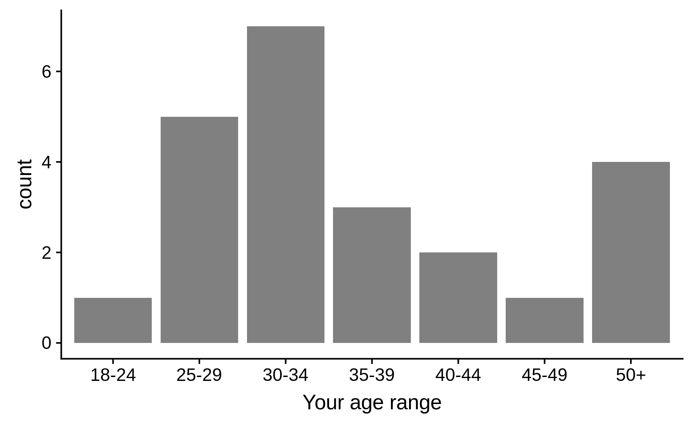
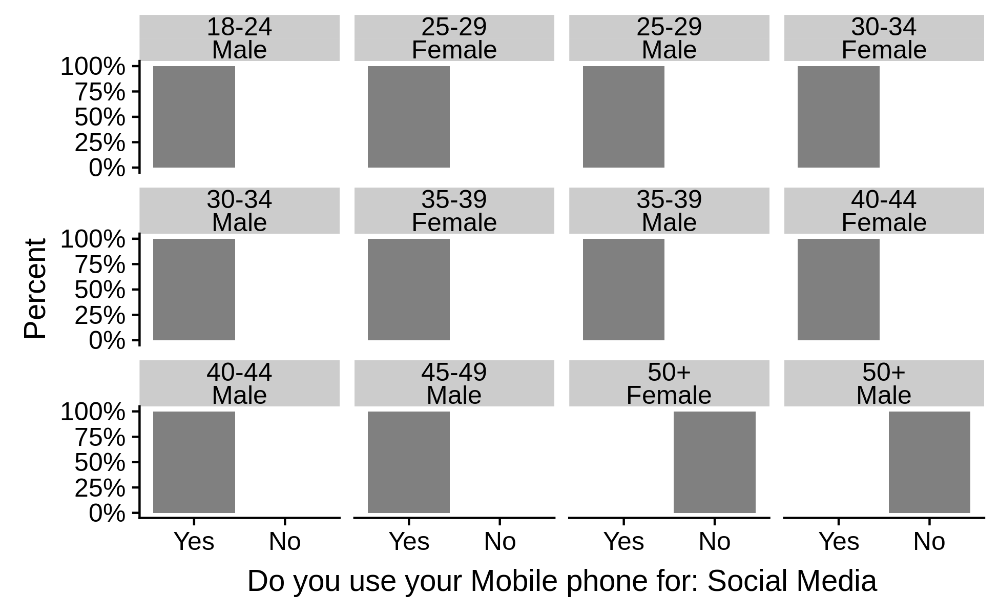

<section>

# UX and Design Deliverables

## Persona and Wireframes

!! annotate persona & wireframes here

## Branding Assets

!! present visual designs here
(Label, Bottle, Vending Machine, Banner)

</section>
<section>
          
# User Research Results

This chapter provides a selection of data presentations, be that in tabular form, graphical representation or both. 
The assessment of the quantitative data spans over 50 sides of A4 and the aggregation of qualitative data is a similar length, so it's impractical to present all the data in this chapter.
The entire set of data evaluation can be found as part of the appendices.

## Basic Participant Data 

What follows is some minimal demographic information about the 23 participants that made up the group of experiment testers, as well as some information concerning their experience with technology relevant to the study.

There participants were mostly male be a ratio of about 3:2, the younger age groups were better represented, however the gender disparity was greater among those younger age groups with a stronger male representation for those under 35 (about 5:2). This was down to the participants that were able to take part.

Gender|Count
:-----:|:-----:
Female|9
Male|14
Table: Gender Demographics {#tbl:tb-demo-gender}

Age group|Count
:-----:|:-----:
18-24|1
25-29|5
30-34|7
35-39|3
40-44|2
45-49|1
50+|4
Table: Age Demographics {#tbl:tb-demo-age}

{#fig:fig-demo-age}

{#fig:fig-demo-age-gender}

### Familiarity with technology

Data was captured from each participant to assess their familiarity with technology, specifically smartphone usage for various interactions and AR. 
These results are helpful to provide context for the results of the experiments.

{#fig:fig-use-mob-email}

{#fig:fig-use-mob-game}

{#fig:fig-use-mob-pay}

{#fig:fig-use-mob-sm}

{#fig:fig-fam-ar}

All participants accessed their emails on their mobile phones and every single demographic that was captured by the study, apart from those over fifty used social media on their mobile phones.
Participants at the older end of the spectrum appear not to play games on their mobile phones, nor do those in the young age groups of this sample of users whereas the middle age groups 30-34, 35-39, and 40-44 seem to be more inclined to play games on their mobile phones.
Broadly speaking using a smartphone to make mobile payments is more popular among females but more significantly those of both genders in the younger age groups show a higher frequency of mobile payment, with the frequency declining with age. 
The data also suggest familiarity with Augmented Reality to be more frequent among males with no prior experience for females of any age group. 
Any correlation between age and familiarity cannot be said to be linear, though the 50+ age group was the only male demographic to have no prior experience.

### Weakness in the sample set

The 18-24 and 45-49 age groups were populated by just one participant each, consequently feedback for these demographics were the least reliable; 
the next least reliable age groups are the 40-44 and 35-39 age groups, in that order. 
Note having at least one person of each gender to cover the age ranges can be considered a major point of concern, and ideally age demographic subset would each have at least five to ten people to allow for more variation of opinion within a given demographic.
One way the disparity in sample size per age group was for mitigated, to some merged age groups allowing for a broader trend analysis but with greater sample sizes per age group and this can be seen in the following analysis.
Another technique used to allow age groups that were under represented to count for the amount they should with regard to normal population distribution for the UK was to apply proportionate weighting to the answers based on the demographics of the country.
This kind of weight adjustment is common practice in order to allow the results to better reflect the population.

</section>
